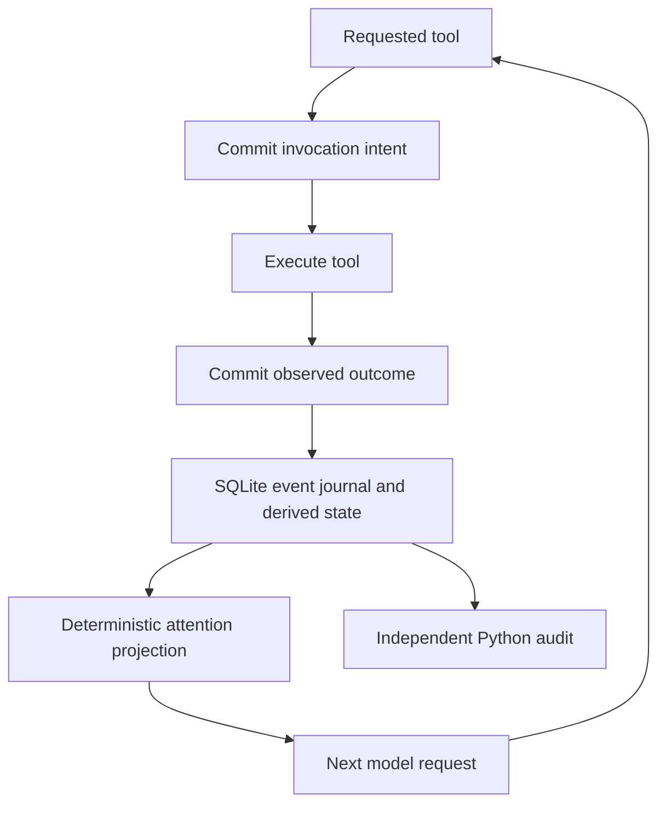

# Cognitive runtime

MF Agent now carries operational experience between disposable model processes.
The runtime records tool execution, applies a versioned set of engineering
priorities, and supplies the next model request with a bounded account of what
needs attention. This implements part of the programmed continuity described in
[runtime identity](runtime-identity.md). It does not establish the broader
personality or demonstrate superior engineering ability through a benchmark.

Consider an executor whose dependency probe fails before its process stops.
Previously, the replacement worker received the task, bounded recovery text,
and any retrieved graph memory; no common runtime reducer carried that exact
operation's unresolved outcome into the replacement model request. Now the
replacement keeps the same work identity and receives a `diagnose_failure`
concern referencing the recorded invocation. If that executor later runs the
same operation successfully, the runtime records `observed_recovery`. A
successful verifier operation does not resolve the executor's failure history.
Neither transition awards task completion: a working dependency probe does not
prove that the requested feature works.

The execution boundary is in
[the Go agent integration](../core/internal/agent/cognition.go), backed by
[the SQLite store](../core/internal/cognition/store.go) at
`.mfagent/cognition.db`. Initialization opens this store independently of optional
graph memory and embeddings. Before calling a tool, the agent records an
invocation ticket. After execution, it records the actual result, including
structured exit status when the tool provides it. A failure, panic, or process
interruption is not converted into a successful observation. Cancellation that
arrives while intent is being recorded is checked before execution begins.



Each work item has an ordered event journal and a materialized state snapshot.
Events carry sequence numbers, policy versions, a hash of the resulting state,
and a SHA-256 link to the preceding event. SQLite `BEGIN IMMEDIATE` transactions
serialize writers across core processes. An event, its updated snapshot,
applicable result receipt, and mutation tracking changes commit together. The
immutable `finish` event is authoritative for duplicate-result idempotency;
the receipt is a derived cache. Repeated delivery of the same result restores
a missing receipt without appending another outcome or repeating its effects.
A conflicting result is rejected. Recording a result never runs the tool again.

The action identity combines the tool name with its normalized JSON input.
Object key ordering is normalized without converting large JSON integers to
floating point. Result digests cover the full output and outcome metadata
before excerpting, so two outputs with the same visible prefix remain distinct.
The journal stores hashes, selected operational identifiers, and bounded
excerpts; it does not retain every original input or full output. A missing
`run_shell` exit status remains an unknown outcome even if its output contains
the text `exit=0`.

[The deterministic reducer](../core/internal/cognition/reducer.go) separates
`Apply`, which updates state from recorded events, from `Project`, which selects
concerns for the next request. Neither function performs model calls, tool calls,
clock reads, or random choices. The same valid event sequence and policy version
produce the same state and attention order. Priorities identify obligations such
as investigating an unfinished operation, diagnosing a failure, refreshing a
stale observation, or seeking information beyond repeated identical results.
Source event numbers accompany each concern. When attention is full, selection
reserves slots for the most urgent concern categories that fit before filling
remaining slots by priority. There are nine categories and eight slots, so
representation of every category is not guaranteed.

Freshness has two distinct sources. A workspace-wide mutation clock advances
around recorded mutating operations, and an active-operation index detects reads
that overlap mutations in other workers or work items. An observation also
retains its source run. Replacing an observer makes that observer's previous
observations require renewed inspection. Starting a supervisor does not advance
the global mutation clock or invalidate the executor's observations merely
because another model started. Failed mutating operations still invalidate prior
observations because they may have changed state before failing.

If an attached journal loses records during tool execution, the agent tracks
recording-gap generations and the number of unrecorded operations still running.
Tools remain callable, but runtime projections are suppressed while a gap remains
unacknowledged. Acknowledgment is retried after tools finish and before supplying
model context. `RecordGap` commits a `gap` event, advances the shared workspace
epoch, and records `lastGapSeq`, without inventing a missing invocation or result
or taking over the current observer's ownership. An `observation_gap` concern
with priority 98 keeps that history explicit. New observations can become fresh
after acknowledgment; earlier freshness assumptions are invalidated.

An invocation records its owning process. During subsequent reads and run
startup, [Windows](../core/internal/cognition/owner_windows.go) or
[Unix](../core/internal/cognition/owner_unix.go) process checks can establish that
an owner exited. The store then records an `orphan` event before removing its
active mutation marker. This lets new observations become useful again while
retaining the interrupted operation and uncertainty about its past effects.
The mechanism does not kill a process, rerun an operation, or infer a successful
write from process death. Access failures, reused process IDs, and other uncertain
liveness observations retain the uncertainty conservatively.

The materialized snapshot is recoverable. If it is missing or inconsistent, the
store verifies the work item's complete journal chain, replays the reducer, and
checks the recorded state hashes before rebuilding the snapshot, result receipts,
and active-operation index. Damaged history is not guessed or discarded. The
hash chain establishes internal consistency; it is not authentication against
someone able to rewrite the entire database.

[TypeScript work bindings](../src/queue/cognition.ts) hash the original goal,
task ID, and task creation time. Rewritten descriptions and reset attempt counts
retain the identity; replacement tasks and different goals receive different
identities. The executor, verifier, supervisor, and phase planner retain distinct
observer identities even when they use the same configured model. Every Go
`Send` creates a fresh run identifier. [Interactive chat](../src/panel.ts)
persists a conversation UUID in workspace state and rotates it on New Session.

[Queue runners](../src/queue/agents.ts),
[independent verification](../src/queue/verification.ts), and
[supervisor monitoring](../src/queue/monitor.ts) pass these bindings across the
RPC boundary. Runtime snapshots arrive as `agent/cognition` notifications.
[The orchestrator](../src/queue/orchestrator.ts) writes bounded, deduplicated
records into the durable task journal, while
[live logs](../src/queue/liveLog.ts) display them. Snapshots do not renew worker
heartbeats. Supervisors are told that these records describe execution and that
output excerpts remain untrusted observations, not instructions or proof of
acceptance criteria.

The Go agent adds only the current projection to each outgoing model request;
it does not append successive snapshots to conversation history. An empty new
snapshot with no observations or omissions is omitted entirely from model
context. The limits are explicit:

| Retained information | Bound |
| --- | --- |
| Durable event journal | Currently retained without a size cap |
| Materialized evidence per work item | 128 observations, with unresolved observations preferred |
| Materialized interrupted history per work item | 32 operations |
| Go attention projection | 8 focus entries, with omission counts |
| Runtime context added to a model request | At most 6,000 bytes including its explanatory preamble |
| TypeScript journal/live projection | Up to 6 focus entries with bounded strings and source references |

The journal retains events evicted from working attention. These bounds limit
specific materialized collections and request context; they are not a total
database or process-memory limit. Unfinished operations and durable history need
their own lifecycle considerations as usage grows.

The independent [Python auditor](../scripts/cognition-audit.py) opens SQLite in
read-only mode and checks event ordering, hash links, invocation/result pairing,
snapshot consistency, and operational uncertainty. When the optional
`cognition_active` and `cognition_receipts` index tables are present, it also
compares their contents against the journal and lists them in `checkedIndexes`.
The report counts `recordingGaps`, includes them in `hasUncertainty`, and checks
the snapshot's `lastGapSeq` against the latest recorded gap.
From the workspace root:

```console
python scripts/cognition-audit.py --database .mfagent/cognition.db
```

Its JSON report includes an explicit `assurance` field: journal consistency
does not establish tool correctness, task completion, recorded OS process death,
current file freshness, or resistance to a full journal rewrite. The auditor
executes no tools and performs no database repairs.

Coverage includes tools executed through the Go agent and explicit
`tools/invoke` requests. Registered tools remain callable when their definitions
are omitted from model context. The Claude CLI provider runs its own internal
agent loop, which this journal does not instrument. Arbitrary external edits and
background children that outlive their core owner are not fully tracked; a
freshness finding applies to recorded operations, not every possible workspace
change. Existing run cancellation and handoff limits still govern the task
lifecycle. If persistence is unavailable or corrupt, visible diagnostics report
the loss of durable observations while requested tool execution remains
available. A process that dies before gap acknowledgment can lose the gap itself.
Other running cores cannot learn an unavailable database's uncommitted facts
until acknowledgment succeeds.

Validation exercises the mechanisms through concrete artifacts.
[Go store tests](../core/internal/cognition/store_test.go) create real SQLite
databases, run concurrent observers, replay their histories, remove or corrupt
derived snapshots, retry result delivery, and invoke the Python auditor against
Go-produced records. [Owner tests](../core/internal/cognition/owner_test.go)
query real current and exited processes.
[Agent tests](../core/internal/agent/cognition_test.go) use controlled model
responses to check hidden-definition tool execution, continuity between fresh
workers, mutation ordering, unknown outcomes, persistence failures, and
cancellation during intent recording.
[Queue tests](../scripts/cognition-queue.test.cjs) exercise the actual TypeScript
request boundary with RPC doubles, observer separation, supervisor recovery,
notification logging, and conversation identity across reloads.
[Python tests](../scripts/cognition-audit.test.py) check inconsistent and damaged
journals. These establish runtime contracts; they do not benchmark the quality
of the model's engineering decisions or universally verify completed work.
