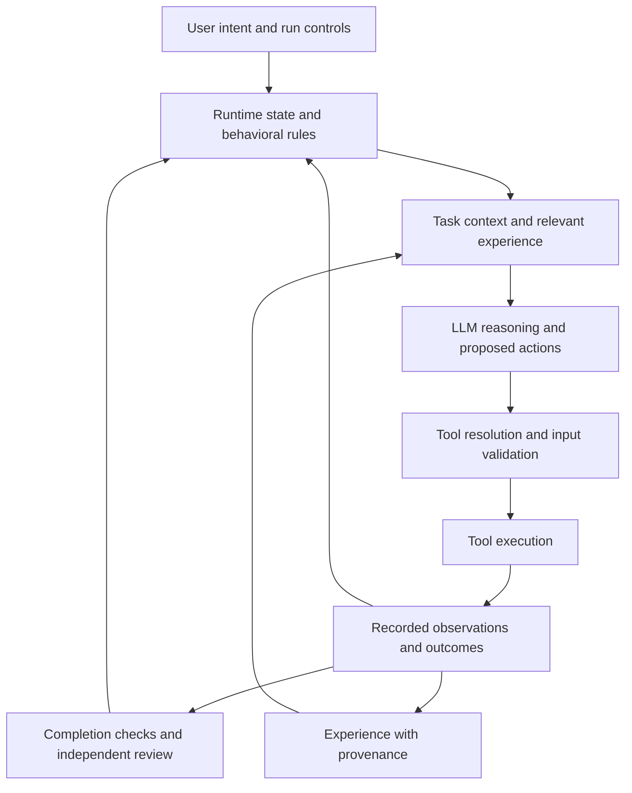

# Runtime identity and model reasoning

The extension itself is the software engineer. The design ambition is to model
"the best software engineer that ever lived": an engineer whose judgment draws
on generations of programming experience and whose working discipline remains
dependable across tasks, sessions, and model changes. This is the standard the
implementation is being built toward.

MF Agent uses programmed behavior to model the continuity, habits, judgment, and
automatic recovery of an experienced programmer. Its identity belongs to the
application: TypeScript, Go, and supporting Python code carry the durable rules
and mechanisms. LLMs supply knowledge, interpretations, plans, and choose tools.
The runtime executes requested registered tools, records their results, and
manages the work lifecycle.

This is the architectural direction. The table below distinguishes existing
mechanisms from behavior that still needs implementation.

A different model may produce a different solution. It should still encounter
the same task ownership, cancellation rules, evidence requirements, and resource
limits. Determinism means that the same recorded state, event, and policy version
produce the same control decision. It does not mean that model output, external
tools, or concurrent events always repeat identically.

Tool descriptions consume model context. The runtime may omit those descriptions
to keep requests focused while preserving the tool registry and execution path.
When an agent requests a registered tool, it can use it even if its description
was absent from that request. This applies to supervisors too. The existing wire
field `disableTools` controls only omission of definitions; its name does not
describe a restriction on execution. Role-specific context shaping must preserve
the tools configured for the workspace.

The human analogy translates into concrete engineering responsibilities:

| Human concept | Program responsibility |
| --- | --- |
| Personality | Stable, explicit priorities: preserve the user's intent, protect working changes, diagnose failures, and report observed results accurately. Enforce measurable rules in code. |
| Deliberate reasoning | Ask models to interpret unfamiliar situations, compare approaches, and propose the next step with supporting evidence. |
| Subconscious mechanisms | Run cancellation, process supervision, state persistence, failure detection, and recovery without waiting for an LLM to remember them. |
| Experience | Retain observations, decisions, outcomes, and lessons with their source and applicability; consult them when similar work returns. |
| Self-protection | Preserve authorized work and recover from accidental failures within the user's run state. Stop and pause take precedence over recovery. |

Generations of programming experience should become executable engineering
practice: explicit state machines, typed interfaces, transactions, controlled
concurrency, bounded operations, diagnostic errors, regression tests, and evidence
for completion. A prompt can explain those practices. Each enforceable invariant
also needs an owning module and a test of what happens when the model violates it.
Semantic judgment still needs reasoning and review.

Engineering excellence has to be observable in the work:

- Preserve the original intent and acceptance criteria throughout planning,
  implementation, verification, and recovery.
- Investigate the repository and the current environment before choosing a
  solution. Consult LLM knowledge with a concrete question and relevant evidence.
- Respect existing interfaces, working changes, and project conventions. Choose
  the smallest coherent change that satisfies the requirements.
- Distinguish a tool error, an environment problem, a faulty assumption, and an
  implementation defect before deciding what to change.
- Track useful progress separately from activity. Preserve completed work and
  the next unresolved step when a worker needs to hand off.
- Verify the requested behavior using observed results, including failure paths.
  Report uncertainty and incomplete checks accurately.
- Retain reusable lessons with their evidence and context. Revisit a lesson when
  the environment or contrary observations change its applicability.

Some of these habits already have deterministic support; others still depend on
model judgment. The implementation map below makes that difference explicit so
the aspiration cannot be mistaken for behavior already delivered.

Language boundaries follow existing responsibilities:

| Layer | Current responsibility | Architectural responsibility |
| --- | --- | --- |
| TypeScript | VS Code integration, model routing, task queue, worker orchestration, supervision, and report parsing. | Own the durable work lifecycle and apply model decisions through explicit state transitions. |
| Go | Agent turns, tool execution, graph memory, provider transports, browser work, and runtime guards. | Enforce execution contracts where actions actually run, independently of the selected provider. |
| Python | The optional document assembler in [scripts/docx-gen.py](../scripts/docx-gen.py) and independent read-only runtime journal auditor in [scripts/cognition-audit.py](../scripts/cognition-audit.py). | Apply explicit contracts to specialized computation, artifact generation, and independent checks of recorded runtime state. |
| LLMs | Planning, implementation proposals, tool selection, interpretation, verification reports, and supervisor recommendations. | Decide which tools the work needs. A model's completion claim is input to validation. |

The intended control flow is:

The current implementation provides these foundations and leaves these gaps:

| Concern | Existing mechanism | Remaining boundary |
| --- | --- | --- |
| Durable task ownership | [src/queue/db.ts](../src/queue/db.ts) claims work transactionally and records task events. [src/queue/orchestrator.ts](../src/queue/orchestrator.ts) coordinates execution, review, stop, pause, and orphan recovery. | Recovery strategy and task rewrites still use model judgment; preserving every original requirement is not mechanically proven. |
| Automatic failure handling | With operational memory attached, [the cognition integration](../core/internal/agent/cognition.go) supplies deterministic attention to failures and repeated observations while recovery tools remain callable. [loop_guard.go](../core/internal/agent/loop_guard.go) retains the legacy repeated-failure stop for hosts without an attached journal. [agent.go](../core/internal/agent/agent.go) handles turn limits and cancellation. The queue detects silent workers and discards abandoned reviews. | Liveness is not progress. A stream of heartbeats or successful but irrelevant calls does not establish useful work. |
| Editing discipline | [core/internal/tools/fs.go](../core/internal/tools/fs.go) checks prior reads and file freshness; [core/internal/tools/registry.go](../core/internal/tools/registry.go) provides path resolution and mutation classification. | Individual tool contracts have distinct coverage. These checks are not a universal restriction on arbitrary shell programs. |
| Stable coding habits | [core/internal/cognition/reducer.go](../core/internal/cognition/reducer.go) implements versioned priorities for unfinished operations, unknown outcomes, failure diagnosis, stale observations, information seeking, and observed recovery. Existing coding prompts retain the original goal and broader workflow. | Operational attention is deterministic. Interpreting requirements, choosing algorithms, and judging whether evidence proves the requested behavior still need reasoning. |
| Operational continuity | [core/internal/cognition/store.go](../core/internal/cognition/store.go) persists invocation intents, outcomes, process ownership, and replayable state in a separate SQLite journal. [src/queue/cognition.ts](../src/queue/cognition.ts) preserves work identity across replacement workers. | This is recorded execution experience. It does not establish the truth of arbitrary output or generalize a successful operation into a universal programming lesson. |
| Working roles and context | [src/queue/agents.ts](../src/queue/agents.ts) omits supervisor tool definitions while preserving configured memory and MCP tools. [src/queue/claudeCli.ts](../src/queue/claudeCli.ts) retains available CLI tools. [src/queue/verification.ts](../src/queue/verification.ts) starts a fresh verifier. | Roles guide the work and context supplied to each model. They do not remove access to configured tools. Verifier independence still relies on how checks are performed and reported. |
| Completion | [src/queue/validation.ts](../src/queue/validation.ts) rejects malformed, interrupted, and insufficient PASS reports. Supervisor verdict parsing also checks the stored report. | Required evidence is largely model-authored text. A well-formed report does not prove that its claimed commands or observations occurred. |
| Experience | [core/internal/memory/graph.go](../core/internal/memory/graph.go) stores observations and lessons; [core/internal/tools/memory_tools.go](../core/internal/tools/memory_tools.go) exposes recall and reflection. | Model-supplied lesson confidence and source are not independently verified. Retrieval frequency must not be interpreted as a history of successful outcomes. |

Future runtime changes should turn one of these boundaries into an explicit
contract. Each change should identify the owning module, accepted inputs, observed
outputs, behavior on violation, and a focused test that uses a failing or
misleading model response. Behavioral rules must hold when the model changes or
fails to follow its prompt.

The [cognitive runtime](cognitive-runtime.md) now supplies a functioning mechanism
for operational memory and attention. It derives evidence from actual execution,
keeps incomplete effects explicit, handles observation invalidation, and restores
damaged snapshots from verified history. The Python auditor checks that history
independently. These are implemented program behaviors with regression coverage;
the broader engineering ambition remains the standard for subsequent work.

The first runtime alignment preserves tool availability across supervisor paths:
Go continues to dispatch calls independently of definition visibility, supervisor
configuration retains the workspace's memory and MCP settings, and CLI supervisors
no longer receive an empty tool list. Regression coverage exercises a model that
requests both reads and writes with definitions omitted, configuration inheritance,
and CLI process arguments. This establishes tool availability in these paths;
it does not claim improved model reasoning or a complete personality implementation.

For example, an evidence-backed completion contract would record tool invocation
IDs and outcomes in code, then require completion reports to reference those
observations for the relevant attempt and workspace state. A runtime check could
reject an invented invocation or a check invalidated by later edits. Independent
review would still judge whether the observations establish the requested
behavior. This is a proposed extension, not an existing guarantee.

Recovery must preserve the distinction between an accidental interruption and a
user decision. A failed worker can be recovered while a run is active. A stopped
or paused run stays stopped or paused until the user resumes it. Continuity means
keeping the work recoverable and the controls dependable.
