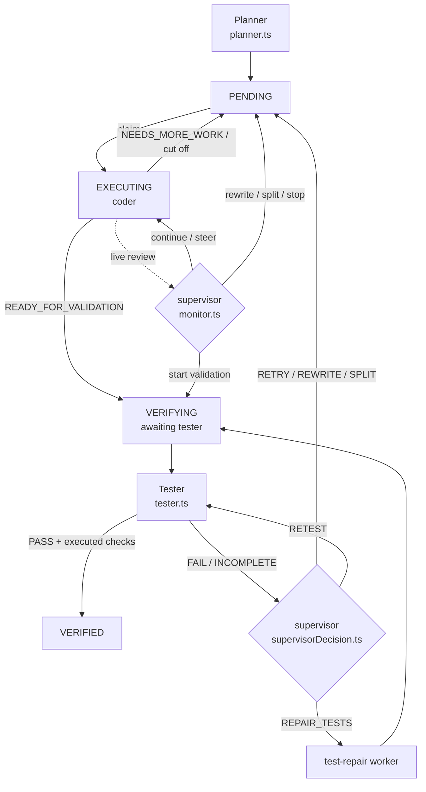

# Supervision architecture

The queue runs four agents, each on its own provider binding:

| Agent | Role binding | Job |
|---|---|---|
| Planner | `planner` | Turns the owner's request into an ordered task list (1–100 tasks). Always runs, on any workspace. |
| Coder | `coder` | Implements one task per session and reports `READY_FOR_VALIDATION` or `NEEDS_MORE_WORK`. |
| Tester | `tester` | Independently verifies one task with its own tools (tests, a served page, the browser). Read-only. |
| Supervisor | `supervisor` | The orchestrator. Woken by the cron; directs the coder and tester and owns every task-list change. |

The design borrows three ideas from current agent frameworks:

- **Supervisor graph over durable state** (LangGraph): every lane is a node, every
  transition is an edge, and the state lives in SQLite, not in a conversation.
- **Cron heartbeat** (OpenClaw): the supervisor is woken on a schedule, by the
  watchdog, and immediately after every handoff, so nothing waits on a person.
- **Evidence-gated completion** (Hermes): a worker's claim never completes a task.
  Only a tester PASS backed by checks the host saw it execute does.

And one rule: **decide in code everything that can be decided from recorded
facts; spend a model turn only on judgement.**

## The cycle

`OrchestratorPipeline.tick()` (`src/queue/orchestratorPipeline.ts`) is one
supervisor cycle. It looks at the head of the queue — the first task that is not
VERIFIED, because work is strictly ordered — and routes:

| Head task | Lane | Model? |
|---|---|---|
| owns a recovery or replacement job | `serviceRecovery` | only when that job is due |
| VERIFYING, awaiting test repair | test-repair worker | yes |
| EXECUTING, with tool evidence | live review (`reviewWork` → `monitor.reviewProgress`) | yes, rate-limited |
| VERIFYING, no report | tester (`runTesterLane`) | yes (tester) |
| VERIFYING, host-produced PASS | accept → VERIFIED | **no** |
| VERIFYING, FAIL / INCOMPLETE | post-test decision (`decideVerification`) | yes |

A cycle keeps routing while each step actually changes the head row (so a
tester report is decided in the same cycle it arrives), and stops as soon as a
step changes nothing. It then pumps the coder.

The live review is paced in LLM calls: a running coder is reviewed after every
`queue.reviewEveryModelCalls` (default 8) of its model calls, counted from its claim
or from the last review. Time never triggers a review, so a slow local model is
reviewed as often per unit of work as a fast hosted one.

## Budgets are LLM calls, never time

| Budget | Setting | Default |
|---|---|---|
| Coder calls per attempt | `queue.workerMaxRounds` | 80 |
| Tester calls per verification | `queue.testerMaxRounds` | 40 |
| Coder attempts per task formulation | task `maxAttempts` | 3 |
| Tester re-runs per attempt | `queue.testerMaxRetests` | 2 |
| Coder calls between live reviews | `queue.reviewEveryModelCalls` | 8 |
| Run breaker (optional) | `queue.maxRunModelCalls` | off |

The only time-based checks are liveness, not budgets: a worker that writes nothing
for `queue.workerSilentMinutes` has lost its process (the core heartbeats every 30
seconds while a model call is pending), and `llm.idleMinutes` cuts a connection that
delivers no bytes at all. Tool commands keep their own timeouts. Its actions (continue with steering
guidance, stop and rewrite the task or its acceptance, split, start validation,
request a test repair, decompose) are pruned by `supervisorReducer` and guarded by
`supervisorGraph` before the orchestrator applies them.

## The tester and the completion gate

`src/queue/tester.ts` runs a normal tool-using turn on the Tester binding, with
the core's validator role (read-only: reads, checks, background servers, the
browser; never edits) and the `agent` verification stage prompt. It captures the
tool outcomes of *this turn* from the live event stream — including every step of
a `run_script` batch — and applies the evidence gate:

- a PASS with no successful executed check (command, test, or browser action) is
  downgraded to INCOMPLETE;
- a PASS for a task whose own text describes browser-visible behavior, with no
  successful browser or Playwright action, is downgraded to INCOMPLETE.

The gate reads only the task's description and acceptance, never boilerplate, so
a task with nothing to do with a browser is never asked for browser evidence.

A stored PASS is accepted only if this host produced it for the current contract
(`verificationAccepted:<id>` meta); anything else is tested again.

## The post-test decision

`src/queue/supervisorDecision.ts` asks the supervisor (response-only, no tools)
to choose among `RETRY`, `REWRITE`, `SPLIT`, `RETEST`, `REPAIR_TESTS`, with the
task list, the contract, the coder's claim and the tester's report in front of
it. `allowedVerdicts` prunes the vocabulary from recorded facts:

- `RETRY` is removed when the attempt budget is spent (a `REWRITE` resets it);
- `RETEST` is capped at `queue.testerMaxRetests` per attempt;
- `REPAIR_TESTS` is removed after a halted repair;
- `REWRITE` is removed for a committed split child, whose contract is fixed.

`verdictViolation` rejects a malformed or pruned reply; one corrected reply is
requested, and if that also fails `fallbackVerdict` applies (retry with the
tester's findings, or planner-authored decomposition once attempts are spent), so
an unreliable supervisor model slows the queue down but never stalls it.

## Deterministic layers for the live review

| Stage | File | Responsibility |
|---|---|---|
| OBSERVE | `supervisorFacts.ts` | Reads the task row and journal once; facts, never opinions. |
| UPDATE | `supervisorState.ts` | Names the condition and the read-time display status. |
| DERIVE | `supervisorReducer.ts` | Prunes the action set and renders the factual prompt preamble. |
| ROUTE | `supervisorGraph.ts` | Action vocabulary, legal transitions, and the guards. |
| SCHEMA | `supervisorSchema.ts` | Whether a reply is a routable decision at all. |
| APPLY | `orchestratorProgress.ts` | Commits the chosen action, fenced against stale snapshots. |

## Extending it

- New fact: extend `SupervisorFacts` and `observeSupervisorFacts`; do not read a
  clock or the database anywhere else.
- New live action: add it to `SUPERVISOR_ACTIONS` and `SUPERVISOR_TRANSITIONS`,
  guard it in `guardViolation`, apply it in `applyProgressDecision`.
- New post-test action: add it to `VERDICT_ACTIONS`, prune it in
  `allowedVerdicts`, validate it in `verdictViolation`, apply it in
  `OrchestratorPipeline.applyVerdict`.
- Decide something in code only when the facts leave exactly one legal outcome.
