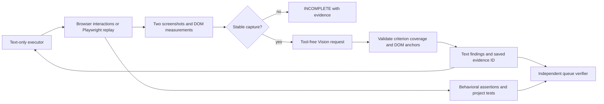

# Visual Witness: layout evidence for a text-only coding agent

The execution model owns the code and browser interactions. A separate Vision
model inspects a bounded rendering without tools or conversation history. The core
binds its findings to the screenshot, DOM measurements, explicit criteria, and
viewport that produced them. Behavioral assertions remain a separate evidence
channel. This is an implemented workflow, not a claim that model judgment is a
deterministic test.



## Protocol

1. Reach the intended state: navigate, authenticate, click or fill, then perform
   the required behavioral checks. Do not send an unrelated landing page for review.
2. Define 1–8 concrete visual requirements with short unique IDs and 1–3 CSS
   selectors each. The selectors anchor the requirement to measured elements.
3. Capture an explicit viewport. Two screenshots, separated by 200 ms, and DOM
   samples must agree; fonts must be ready. The capture contains URL, viewport,
   scroll position, element counts, rectangles, visibility, text snippets, and
   overflow measurements. Continuous animation produces INCOMPLETE, not a pass.
4. Save the PNG and capture JSON under a unique `.mfagent/layout/evidence-*`
   directory. A SHA-256 evidence ID binds the screenshot, DOM, and criteria.
5. Make one Vision call with the image and the compact evidence packet. It has no
   tools and cannot change code, tests, or the page. The configured Vision role
   receives the image; the execution model receives only the resulting text.
6. Validate every criterion ID, status, and observation. Missing, duplicate, or
   unknown IDs, malformed JSON, and provider failures cannot produce PASS.
   An absent, ambiguous, hidden, or fully offscreen selector forces UNCERTAIN
   regardless of the model's answer. Scroll to offscreen targets in a separate
   browser capture; test deliberate absence/hidden states with behavioral assertions.
7. Return per-criterion PASS/FAIL/UNCERTAIN and an aggregate PASS/FAIL/INCOMPLETE.
   A FAIL indicates at least one reported visual defect; other criteria may remain
   uncertain. Save the report beside the capture and include its artifact path.
8. After a relevant edit, reload and repeat the checks with new evidence. An old
   report describes its captured state, not the current state of the source tree.

Vision supplies an observation and an optional suggested measurement, not patch
code. Suggested checks are not executed automatically. Executors must verify the
diagnosis against source and browser evidence before editing. This keeps a weak
vision model from becoming an autonomous second coder.

## Tools

`browser_layout_check` uses the exact session owned by `browser_open`, `browser_click`,
`browser_fill`, and `browser_eval`. All browser tools are sequenced in call order
within a batch, including reads and captures. This fixes the old behavior where a
read could race a click or run before navigation.

Example input after reaching a dashboard:

```json
{
  "width": 1280,
  "height": 800,
  "criteria": [
    {
      "id": "toolbar",
      "requirement": "Toolbar buttons fit on one row without overlap or clipped labels.",
      "selectors": [".toolbar"]
    },
    {
      "id": "form",
      "requirement": "The form remains inside the content column without horizontal clipping.",
      "selectors": ["main", "form"]
    }
  ]
}
```

Use selectors actually observed in the project. Use a second capture at a mobile
viewport for responsive requirements. Layout checks concern visible geometry;
exact contrast ratios, accessibility semantics, click outcomes, and form logic
require separate deterministic checks.

`playwright_layout_check` provides the same protocol for a short declarative replay.
It uses the project's installed `@playwright/test`, without generating a spec or
editing project configuration. It starts a fresh headless browser and does not
share the built-in browser's page or cookies.

```json
{
  "url": "http://127.0.0.1:5173/dashboard",
  "width": 390,
  "height": 844,
  "steps": [
    { "kind": "click", "selector": "#open-menu" },
    { "kind": "visible", "selector": "#mobile-menu" }
  ],
  "criteria": [
    {
      "id": "menu",
      "requirement": "Menu labels are readable and contained within the viewport.",
      "selectors": ["#mobile-menu"]
    }
  ]
}
```

Replay accepts at most 12 steps: click, fill, select, visible, and hidden. Fill and
select accept a value. An optional `storage_state` is a workspace-relative existing
Playwright authentication file. The tool does not create or modify that file.
Replay records completed actions/assertions; a failing step stops capture and
returns an error, not a visual pass. A full existing suite still runs through
`playwright_test`. The replay intentionally does not import the project's test
config, fixtures, webServer setup, or global setup: start the application and
supply authentication explicitly, or use the real suite for complex fixtures.

## Local Windows and remote Linux

The extension declares `extensionKind: ["workspace"]`. VS Code runs it with the
workspace: locally for a local project, on the server for Remote SSH. Consequently
the Go core, Chromium, Node, URLs, and artifact paths refer to that host. Remote
headless execution needs no laptop browser, X display, or exposed CDP port.
This follows VS Code's [workspace extension model](https://code.visualstudio.com/api/advanced-topics/remote-extensions).

- Built-in browser testing uses the bundled Go driver and detected Chromium/Chrome/
  Edge. It needs no Node package or Playwright project. `MFAGENT_CHROME_PATH` is an
  executable override on the workspace host.
- Playwright replay needs Node and the project's installed `@playwright/test`.
  Project suites additionally need their existing `playwright.config.*`.
  `playwright_status` distinguishes these prerequisites; it cannot guarantee that
  a browser binary or all Linux shared libraries are installed until launch.
- Suite runs and browser installation invoke `node` with the installed CLI's
  absolute path and separate arguments. They do not invoke `npx.cmd`, interpolate
  commands into a shell, or download a package implicitly.
- Playwright manages its own browser revision. `playwright_install` installs that
  revision and optionally Linux dependencies, as described in the official
  [browser installation guide](https://playwright.dev/docs/browsers).
- Cancellation terminates the Playwright process tree, including descendants, on
  Windows and Linux. Windows helpers run without console windows. The built-in
  browser also observes cancellation of the calling request.
- Each core now has an isolated Chromium profile. Executor and verifier sessions
  can overlap safely. Chromium lock files are never deleted to force access to a
  live profile. **Login no longer persists between queue workers**: provide
  credentials/test setup per task, or existing Playwright storage state.

Screenshots can vary with fonts, operating system, and browser version. Keep
Playwright pixel baselines specific to a controlled environment; do not update
baselines to conceal failures. Playwright's own screenshot assertions wait for
two matching samples before comparing a baseline; see its
[screenshot assertion documentation](https://playwright.dev/docs/api/class-pageassertions).

## Model routing, cost, and limits

Image blocks are supported by the core's OpenAI-compatible and Anthropic
transports and by the VS Code language-model proxy. Worker initialization merges
provider overrides so the configured Vision binding survives a Coding override.
Provider rejection of image input is reported as incomplete evidence; choose an
image-capable Vision model. The execution model needs only tool calling and text.

Each review makes at most one Vision request, limited to 4096 output tokens and
three minutes. Captures and criteria are bounded; a failing format is returned to
the executor rather than triggering another model repair loop. Vision usage is
included in the worker's token accounting. Two matching samples are a stability
heuristic, not proof that a dynamic page cannot change later.

The initial implementation reviews one viewport at a time and has no reference-
image comparison or automatic accessibility audit. It does not enforce the queue
model's final judgment: supervisors must still require visual and behavioral
evidence where the task calls for both. Layout artifacts may contain page data;
they stay in the workspace and screenshots are sent to the selected Vision provider.
